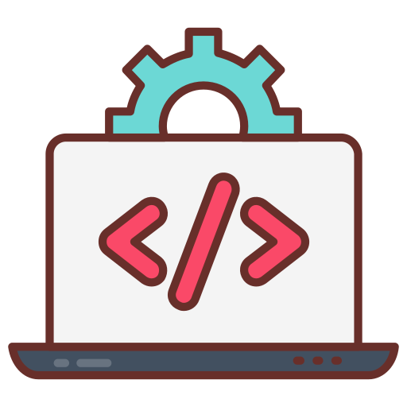

# 💻 Repositório de Programação Back-End (PBE)

<p align="center">
  
</p>

Este repositório reúne materiais e atividades produzidos durante a disciplina de **Programação Back-End (PBE)**, com ênfase em lógica de programação, organização de código, boas práticas e criação de funcionalidades voltadas ao lado do servidor das aplicações.

O objetivo é fortalecer os conhecimentos essenciais de programação através de exercícios práticos, registros teóricos e desafios focados no desenvolvimento back-end.

---

## 🧠 Conteúdos abordados

- Fundamentos do desenvolvimento back-end
- Uso de condicionais e operadores lógicos
- Criação de funções e organização modular do código
- Princípios de Programação Orientada a Objetos (POO)
- Construção de fluxogramas e raciocínio algorítmico
- Interpretação e tratamento de variáveis
- Atividades práticas voltadas à lógica de programação 

---

## 🚀 Como utilizar

1. Faça o clone do repositório:
   ```bash
   git clone https://github.com/LaysllaOreti/Atividades-PBE.git
   ```

---
## 📁 Estrutura de Pastas

```bash
📦 Programação_Back_End
├── Anotações                         
├── Avaliação Programação Orientada a Objeto          
├── Lista Condicionais 03_04_2025          
├── Lista Fluxograma 20_02_2025                                   
└── Lista POO                        
